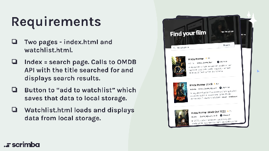

# Movie Watchlist App

## Table of Contents
- [Overview](#overview)
- [Requirements](#requirements)
- [Personal Stretch Goals](#personal-stretch-goals)

## Overview
This project is part of Scrimba's Frontend Career Path. Specifically, it belongs to Module 8: Working with APIs.

## Requirements
This is a solo project provided by Scrimba. The guidelines are as follows:

- **Build from scratch**
- **Two pages**: `index.html` and `watchlist.html`.
  - `Index` = Search page. It calls the OMDB API with the title searched for and displays the search results.
  - Button functionality to "add to watchlist", which saves the movie data to local storage.
  - `Watchlist.html` loads and displays movies from local storage.

## Figma File
The design mockups for the project can be found [here](https://www.figma.com/file/jhFRdFIdHpRxsDznNXtpXw/Movie-Watchlist?node-id=2%3A17&mode=dev).

## Personal Stretch Goals
- **Focus on Accessibility**: Ensuring that the application is usable by as many people as possible.
- **CSS Refactor**: Implementation of CSS Variables and the BEM naming convention for better maintainability.
- **UI/UX Improvement**: Enhancing the user interface and overall user experience.
- **Additional Page for Movie Details**: To provide users with more in-depth information about a particular movie.